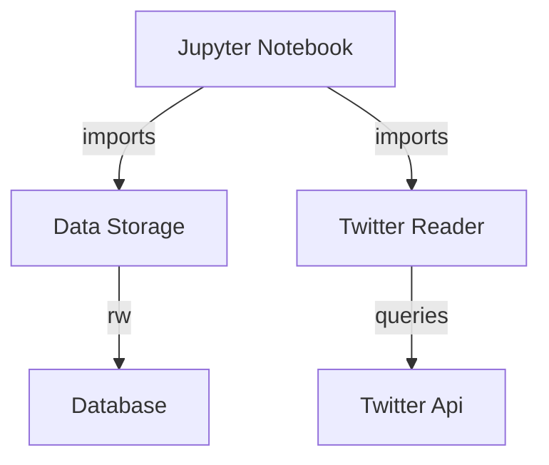

## Components

### Jupyter Notebook
The notebook is used as the interface to the user, it imports the Twitter Manager library for some functionality to query the Twitter API. Imports the data storage module to have some persistance.

### Twitter Manager
Can query the Twitter API with a term.

### Data Storage
Can save and read saved tweets.
<br>
<br>


## Models

### DBConfig
A model for storing the database configuration
```python
dbname='twitter'
host='localhost'
user='postgres'
password='bobolo'
```

### APIConfig
A model for storing twitter api configuration
```python
conf_json_path = './local_configs/api_keys.json'
bearer = data['bearer']
tweet_fields = ['author_id','text','created_at']
options = {'max_results': 10}
```