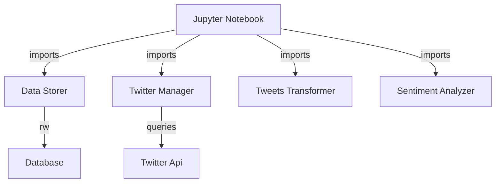

## Components

### Jupyter Notebook
The notebook is used as the interface for the user, it imports the Twitter Manager component for querying the Twitter API, and imports the Data Storage module to have some persistance.
***

### Twitter Manager
Can query the Twitter API with a term.
<br>
<br>
```python
query(query: str, pages=1):
    """A simple query which gives back Tweets"""
```
Given a twitter query, this function pulls back a list of tweets in dictionary format.
One can ask for a certain number of pages to be retrieved. The tweets per page are defined in the APIConfig model (_max results_ parameter).
***

### Data Storer
Can save and read saved tweets.
<br>
<br>
```python
save_tweets(tweets: []) -> None:
    """A function which pushes tweet dicts to a db"""
```
Saves a list of tweets, which are just a list of dictionaries.
<br>
<br>
```python
read_tweets() -> []:
    """A function which pulls all tweet dicts from a db"""
```
Reads a list of tweets from the database table.
<br>
<br>
```python
clear_tweet_table() -> None:
    """A function which clears the tweet table"""
```
Clears all previously stored tweets.
***

### Tweets Trasformer
Extracts meaningful text from tweeet texts
<br>
<br>
```python
text_only(tweet_text: str) -> str:
    """A function which stripes the text from garbage"""
```
***

### Sentiment Analyzer
Analyzes the sentiment of a text between positive and negative.
<br>
<br>
```python
def load_training_data(
    data_directory: str = "aclImdb/train",
    split: float = 0.8,
    limit: int = 0
) -> tuple:
```
The training data could be loaded for a new model training. Here we are using a movie review dataset called aclImdb.
This function gives back training and testing data.
<br>
<br>
```python
def train_model(training_data, test_data=None) -> nlp
```
Returns a trained nlp model which can be used for analyzing text.
<br>
<br>
```python
def train_model(training_data, test_data=None) -> nlp
```
Returns a freshly trained nlp model which can be used for analyzing text.
<br>
<br>
```python
def load_model(path) -> nlp
```
Returns a previously saved nlp model which can be used for analyzing text.
<br>
<br>
```python
def save_model(nlp, path) -> nlp
```
Returns a previously saved nlp model which can be used for analyzing text.
***

<div style="page-break-after: always;"></div>


## Models

### DBConfig
A model for storing the database configuration
```python
dbname='twitter'
host='localhost'
user='postgres'
password='bobolo'
```


### APIConfig
A model for storing twitter api configuration
```python
conf_json_path = './local_configs/api_keys.json'
bearer = 'aaaaabbbbbbbcccc'
tweet_fields = ['author_id','text','created_at']
options = {'max_results': 10}
```