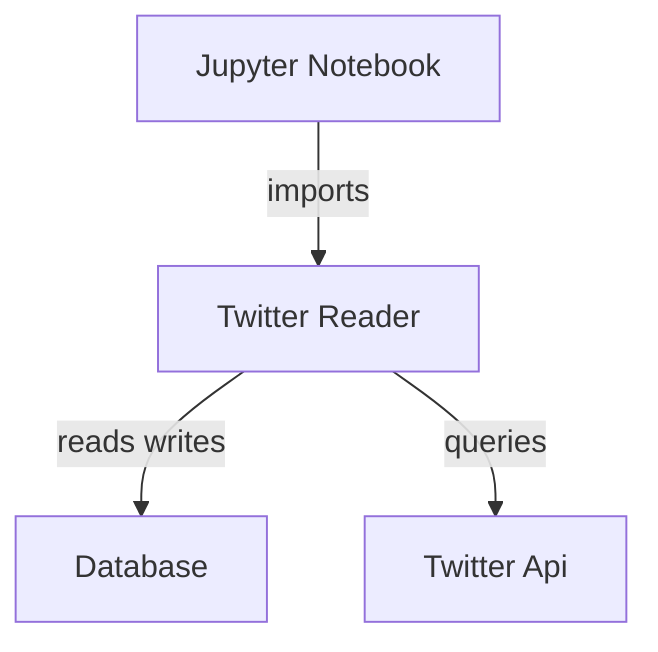

## Jupyter Notebook
The notebook is used as the interface to the user, it imports the Twitter Reader library and offers some functions to query the Twitter API.

## Twitter Reader
The library which contains the functions to access the Twitter API, and has persistance capabilities thanks to a sqlite interface.

## Database
A simple SQlite database.